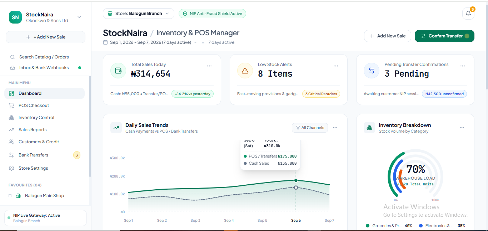

# StockNaira - Inventory & POS Manager



> **A responsive, modern inventory and Point-of-Sale (POS) management dashboard tailored for Nigerian retail business owners and commercial market hubs.**

---

## 🌟 Executive Summary & Target Audience

**StockNaira** is an all-in-one retail operational dashboard and POS system purpose-built for the high-velocity realities of Nigerian retail commerce. 

It is tailored specifically for:
- **Commercial Hub Merchants:** Traders and shop owners in major commercial centers across Nigeria, including **Balogun Market (Lagos Island)**, **Alaba International Market (Ojo)**, **Computer Village (Ikeja)**, **Trade Fair Complex (ASPAMDA / Badagry Expressway)**, and **Wuse II / Utako Markets (Abuja)**.
- **Boutique & Multi-Store Owners:** Apparel, textile, beauty, electronics, and fast-moving consumer goods (FMCG) retailers running multi-branch stores or high-density warehouse hubs.
- **Cashiers & Floor Managers:** Retail staff requiring sub-second checkout speeds, rapid item lookup, and instantaneous receipt generation.

---

## 💡 Key Problems Solved

### 1. Mixed Cash and Bank Transfer Reconciliation
In Nigeria's dynamic retail climate, customers frequently split transactions (e.g., paying ₦10,000 in physical cash and ₦15,000 via bank transfer or POS terminal). StockNaira features an integrated **Mixed Payment Calculator** that computes exact cash tendered, change due, and pending transfer balances in real-time.

### 2. Elimination of Fake Transfer & SMS Alert Scams
One of the most persistent threats to Nigerian shop owners is customer "fake bank alerts" (forged SMS messages or doctored transaction screenshots). StockNaira introduces a dedicated **NIP (Nigerian Instant Payment) Anti-Fraud Confirmation Hub** that matches incoming customer payments against live bank session IDs (Moniepoint, OPay, GTBank, Zenith, Kuda, PalmPay) before orders are marked confirmed and goods released.

### 3. Real-Time Stockout Prevention & Safety Thresholds
Fast-moving goods (such as cartons of provisions, bags of sugar, fast chargers, and textile rolls) often sell out unpredictably. StockNaira maintains real-time stock gauges with color-coded safety minimums and one-click purchase order reorders linked to local market suppliers.

### 4. 7.5% Nigerian VAT & Fiscal Transparency
Automated calculation of standard 7.5% Nigerian Value Added Tax (VAT) with clear itemized breakdowns, total ledgers, and 80mm thermal receipt printing for on-the-spot customer issuance.

---

## 🎨 UI Layout & Design Architecture

StockNaira's visual architecture is inspired by modern cloud-based accounting and project management dashboards, enhanced with Google Stitch design system principles:

1. **Header & Store Selector:**
   - Multi-branch switcher (`Balogun Branch`, `Alaba Intl Branch`, `Trade Fair Branch`, `Computer Village Branch`).
   - Quick date range filter (`Today (Live Feed)`, `Sep 1 - Sep 7`, `This Month`, `Q3 2026`).
   - Secondary action: `+ Add New Sale` (Opens interactive POS Terminal).
   - Primary action: `Confirm Transfer` (Signature Nigerian fintech emerald green button with live unconfirmed alert counter).

2. **3 Key Metric Overview Cards:**
   - **Total Sales Today (₦245,800):** +14.2% daily growth, detailing the breakdown of physical Cash (₦95,000) vs Bank Transfer & POS (₦150,800).
   - **Low Stock Alerts (12 Items):** Highlights 3 critical items at zero stock and 9 further SKUs at or below their reorder point.
   - **Pending Transfer Confirmations (3 Pending):** Real-time monitoring of ₦42,500 unverified bank transfers.

3. **Visual Analytics & Charts:**
   - **Daily Sales Trends (65% width):** Interactive dual-curve spline line graph comparing *Cash Payments* (dashed neutral line) against *POS / Bank Transfers* (solid emerald line) across the week, with rich hover tooltips and channel toggles.
   - **Inventory Breakdown Donut Gauge (35% width):** Concentric arc gauge breaking down stock volume by department (*Groceries 40%*, *Electronics 35%*, *Fashion 25%*), with center warehouse load metrics (`4,820 Units / 70%`).

4. **Tabbed Data Ledger:**
   - **Recent Transactions Tab (24):** Complete ledger with customer names, purchased items, formatted Naira amounts (`₦`), payment badges (Cash, POS, Transfer, Split), and receipt printing.
   - **Low Stock Items Tab (12):** Stock level visual bars, minimum reorder thresholds, unit costs, and instant PO generation (derived from the shared stock ledger, not a static mock).
   - **Pending Transfers Tab (03):** Session ID lookup, sender bank identification, auto-webhook matcher, and fraud rejection buttons.
   - **Suppliers & Reorders Tab (04):** Lead times, outstanding trade credit, and direct WhatsApp links to Lagos distributors.

5. **Dedicated Inventory Control View (own sidebar route):**
   - **Searchable Product Ledger:** Sortable table of 34 wholesale SKUs with SKU, Item Name, Category, Stock Level (with in-cell fill bar), Reorder Point, Unit Price, Cost Price, and row-level `Edit` (inline editing) / `Restock` actions.
   - **Stock Status Filters:** All SKUs / Fast Movers / Reorder Needed / Stocked Up / Out of Stock tabs with live counts, plus category and text filters.
   - **Inventory KPI Widgets:** Total units in stock (`4,820`), stock value at cost, 30-day fast-mover velocity, stockout risk count, and reorder-needed count.
   - **Add Product:** Validated new-SKU form with auto-generated SKU suffix and numeric guards.
   - **Batch Restock:** Multi-line purchase order that pre-selects every reorder-needed or stockout SKU, captures PO number, supplier, per-line quantity and unit cost, then posts the whole order to the shared stock ledger in one action.
   - **Single-Source-of-Truth Ledger (`inventoryData.js`):** Dashboard donut, dashboard low-stock tab, this table, and every restock flow read the same 34-SKU array, so a restock instantly updates all views.

6. **Dedicated Sales Reports View (own sidebar route):**
   - **Financial Summary Cards:** Gross Sales, VAT Collected (7.5% computed on the exclusive base), Cash vs Digital split, and Average Basket of Sale, each with period-over-period deltas.
   - **Date Range Filters:** Today, Last 7 Days, This Month, or a Custom window (Sep 1–30, 2026 dataset anchored to the dashboard figures).
   - **Cash vs POS/Bank Transfer Chart:** Dependency-free grouped SVG bar chart with hover tooltips, Y-axis gridlines, and an inclusive/exclusive VAT toggle.
   - **Top Selling Products:** Ranked top 10 by units sold with revenue bars and share-of-volume percentages.
   - **CSV Export:** BOM-prefixed CSV downloads for the trend series and top sellers (opens cleanly in Excel).
   - **Printable Daily Reconciliation:** Off-screen reconciliation sheet with per-day cash, POS, transfer, and variance totals plus cashier sign-off, printed via `@media print`.

7. **Dedicated Store Settings & Multi-Channel Configuration:**
   - **Business Profile:** Registered merchant name, CAC registration (`RC-1849204`), Federal TIN (`23849102-0001`), Balogun Market physical address, and branch linkages.
   - **Payment & NIP Webhook Hub:** Configured merchant receiving bank accounts (Moniepoint, OPay, GTBank, Zenith, Kuda), NIP live gateway switch, webhook endpoint/secret key management, and instant webhook test simulator.
   - **Tax, VAT & Thermal Receipt Engine:** 7.5% Nigerian statutory VAT rules, exclusive/inclusive pricing modes, and live 80mm thermal receipt preview updating dynamically.
   - **Low Stock Threshold Controls:** Interactive sliders for global safety inventory triggers (`≤ 5 units`) and category-specific safety buffers.
   - **Team & Staff Access Matrix:** Cashier 4-digit POS PIN management, manager discount/refund overrides, and granular operational permissions.

### Navigation Model
Sidebar items resolve to real workspaces instead of dashboard scroll anchors: `Dashboard`, `Inventory Control`, `Sales Reports`, and `Store Settings` each render a dedicated view (the header title and subtitle update per page). `POS Checkout` and `Bank Transfers` intentionally open as overlay modals on top of the current page so the cashier flow never loses context, and `Customers & Credit` is a parked placeholder.

---

## 🛠️ Tech Stack & Google Stitch MCP Integration

- **Frontend Framework:** React 19 + Vite 6
- **Styling & Design System:** Tailwind CSS v3 + Google Stitch Semantic Design Specification (`DESIGN.md` adhering to `taste-design` standards)
- **Typography:** `Plus Jakarta Sans` (UI & Headings) + `JetBrains Mono` (Naira tabular figures and NIP reference hashes)
- **Icons:** Lucide React
- **Chart Engine:** Native zero-dependency SVG cubic bezier curves and radial arc gauge engine for blazing-fast 60fps rendering without chart bundle bloat.
- **Google Stitch MCP Integration:**
  - Designed according to Stitch's semantic design system guidelines (`DESIGN.md`).
  - Compatible with Stitch MCP tool workflows (`upload_design_md`, `create_design_system_from_design_md`, `generate_screen_from_text`) for screen iterations and design variant synthesis.

---

## 🏛️ Technical Decisions & UX Trade-offs

1. **Custom SVG Charts vs. Heavy Chart Libraries:**
   - *Decision:* Rather than adding heavy third-party charting libraries (which increase bundle size and complicate responsive tooltips), we engineered a lightweight SVG cubic bezier spline generator and concentric radial gauge.
   - *Benefit:* Instant loading, zero layout shifts, pixel-perfect alignment with the reference UI, and precise tooltip positioning.

2. **NIP Anti-Fraud Workflow:**
   - *Trade-off:* Requiring cashiers to verify bank transfers adds a step to the checkout flow.
   - *Solution:* Split into automated webhook matching for digital POS/virtual accounts and manual lookup only for unverified SMS alerts.

3. **Monetary Typography & Formatting:**
   - *Decision:* Enforced `JetBrains Mono` with tabular numbers for all Naira currency strings (`formatNaira`), ensuring vertical column alignment in busy financial ledgers.

---

## 🚀 Getting Started

### Prerequisites
- Node.js (v18 or newer)
- npm (v9 or newer)

### Installation & Run

```bash
# Clone the repository
git clone https://github.com/ChijiokeUhegwu/StockNaira.git
cd StockNaira

# Install dependencies
npm install

# Start development server
npm run dev

# Build for production
npm run build

# Preview production build
npm run preview
```

---

## 🧪 Verification & Testing

- ✅ **Build Integrity:** Clean build with Vite (`npm run build`) with zero TypeScript/JSX errors (1,868 modules; 465 kB JS / 46 kB CSS).
- ✅ **View Render Smoke Test:** App (dashboard), Inventory Control, Sales Reports, and Store Settings were server-rendered in isolation to catch runtime errors; all four render cleanly.
- ✅ **Derived Data Math Check:** Node-verified that the 34-SKU ledger yields 4,820 units / 40-35-25% category split, 12 reorder-or-stockout SKUs, and that each reports date window (Today / Last 7 / This Month / Custom) reconciles VAT, cash, digital, and transaction totals.
- ✅ **Responsive Viewports:** Verified across Desktop (1440px+), Laptop (1024px), Tablet (768px), and Mobile (375px).
- ✅ **Thermal Print Receipt & Reconciliation:** Tested slip styling and the printable daily reconciliation sheet via `@media print` CSS.
- ✅ **Interactive Flows:** Tested New Sale creation, live cart math, mixed cash/transfer split calculation, transfer approval, supplier quick restock, multi-SKU batch restock, inline inventory edits, and CSV export.
